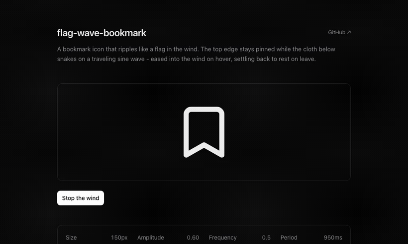

# flag-wave-bookmark

A React bookmark icon that ripples like a **flag in the wind**. The top edge stays pinned; the cloth below snakes on a traveling sine wave - eased into the wind on hover, settling back to rest on leave.

Built on the [lucide](https://lucide.dev) bookmark outline, animated procedurally - no CSS keyframes, no animation library, no runtime dependencies.



**Live demo:** <!-- LIVE_DEMO -->[flag-wave-bookmark.vercel.app](https://flag-wave-bookmark.vercel.app)<!-- /LIVE_DEMO -->

## Why it looks good

- **The shape ripples, it doesn't lean.** Each point is displaced sideways by an amount that grows from 0 at the pinned top to its peak at the free bottom edge - so the outline itself snakes, like real cloth, instead of just tilting.
- **Traveling wave.** The ripple advances down the flag over time; it's not a single static bend.
- **Eased, never snapped.** The amplitude lerps toward its target, so the flag picks up the wind on hover and settles back on leave instead of cutting on and off.
- **Three drive modes.** Hover (default), always-on (`active`), or imperative (`ref.startAnimation()` / `ref.stopAnimation()`).
- **Accessible.** Honors `prefers-reduced-motion` - reduced motion just renders the bookmark at rest, with no loop running.
- **Zero runtime dependencies.** Just React, in a single self-contained file. No CSS file, no config: it's pure SVG path math on a `requestAnimationFrame` loop.

## Install

From the [21st.dev](https://21st.dev) registry (one command):

```bash
npx @21st-dev/registry add @serafimcloud/flag-wave-bookmark
```

Or just copy the single file - [`src/components/bookmark.tsx`](src/components/bookmark.tsx) - into your project. No CSS, no config. (React 18+.)

## Usage

```tsx
import { BookmarkIcon } from "@/components/bookmark";

// waves on hover, settles on leave
<BookmarkIcon />

// waves continuously (e.g. a "saved" button)
<BookmarkIcon active size={20} />

// tune the wind
<BookmarkIcon active amp={0.7} freq={0.5} period={900} />
```

Imperative control via a ref - wave the icon from its parent's hover (or any other trigger):

```tsx
import { useRef } from "react";
import { BookmarkIcon, type BookmarkIconHandle } from "@/components/bookmark";

function SaveButton() {
  const ref = useRef<BookmarkIconHandle>(null);
  return (
    <button
      onMouseEnter={() => ref.current?.startAnimation()}
      onMouseLeave={() => ref.current?.stopAnimation()}
    >
      <BookmarkIcon ref={ref} /> Save
    </button>
  );
}
```

> Passing a `ref` hands you manual control and turns off the icon's built-in hover, so the wave follows your button's hover (or whatever you wire it to) instead of the icon's own.

## Props

| Prop        | Type      | Default | Description                                                                  |
| ----------- | --------- | ------- | ---------------------------------------------------------------------------- |
| `size`      | `number`  | `28`    | Pixel size of the square icon.                                               |
| `active`    | `boolean` | `false` | Wave continuously. When `false`, the icon waves only on hover.               |
| `amp`       | `number`  | `0.5`   | Peak sideways sway at the free (bottom) edge, in viewBox units. `0` = off.   |
| `freq`      | `number`  | `0.5`   | Ripples along the length (1 = a single S from top to bottom).                |
| `period`    | `number`  | `1000`  | Milliseconds per wave cycle. Lower = faster flapping.                        |
| `className` | `string`  | -       | Applied to the root `<div>`; also forwards any other `<div>` props.          |

The icon draws with `stroke="currentColor"`, so color it with CSS `color` on the element (or any parent).

## How it works

The bookmark is the lucide outline in a `24x24` viewBox. Its top edge (`y=3`) is treated as the pinned hoist of a flag; everything below is cloth. `buildBookmarkFlagPath(phase)` walks the outline and offsets every point horizontally by

```
dx(y) = amp * u * sin(2π · freq · u + phase),   where u = (y - 3) / (21 - 3)
```

`u` is 0 at the pinned top and 1 at the free bottom, so the displacement vanishes at the top and is largest at the bottom - the shape snakes instead of sliding sideways. The straight edges are subdivided into 16 segments each so the rippled curve stays smooth.

`useFlagWave` advances `phase` on a `requestAnimationFrame` loop and lerps the amplitude toward its target (`0.12` per frame), so the flag eases in and out. When the target is 0 and the amplitude has decayed near zero, it snaps back to the exact rest path and stops the loop. `prefers-reduced-motion` skips the loop entirely.

`buildBookmarkFlagPath` and `useFlagWave` are exported too, if you want to drive your own SVG.

## Demo app

This repo is also a tiny Next.js app showcasing the component. Run it locally:

```bash
npm install
npm run dev
# open http://localhost:3000
```

## Recording the GIF

The demo GIF is produced from the running demo with Playwright + ffmpeg:

```bash
npm i -D playwright && npx playwright install chromium
npm run dev                                   # in one terminal
DEMO_URL=http://localhost:3000 npm run record # in another
# then convert the webm:
ffmpeg -y -i recording/*.webm \
  -vf "fps=24,scale=820:-1:flags=lanczos,split[s0][s1];[s0]palettegen=max_colors=128[p];[s1][p]paletteuse=dither=bayer" \
  -loop 0 public/demo.gif
```

## License

[MIT](LICENSE) © [serafim](https://github.com/serafimcloud)
